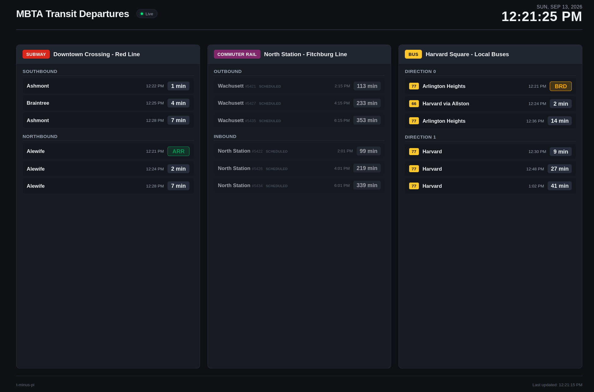

# t-minus-pi

A lightweight Python application that fetches real-time MBTA transit data and renders a clean, glanceable web dashboard optimized for a Raspberry Pi display.

## Dashboard



## Overview

t-minus-pi connects to the MBTA V3 API to retrieve real-time departure predictions, vehicle positions, and service alerts across subway, commuter rail, and bus routes. The dashboard is designed to run in fullscreen kiosk mode on a Raspberry Pi connected to an HDMI display, providing an at-a-glance departure board for daily transit tracking.

Tracked stops, routes, directions, and display names are fully customizable through a simple configuration file.

## Target Hardware and Environment

- Device: Raspberry Pi 4 (4GB RAM) running Raspberry Pi OS.
- Display: 1080p (1920x1080) HDMI portable monitor.
- Display Mode: Fullscreen Chromium kiosk mode with screen blanking disabled.

## Getting Started

### Prerequisites

- Python 3.10 or higher
- MBTA API key (free at https://api-v3.mbta.com/register)

### Installation

1. Clone the repository:
   ```bash
   git clone <repository-url>
   cd t-minus-pi
   ```

2. Create and activate a virtual environment:
   ```bash
   python -m venv .venv
   source .venv/bin/activate  # On Windows: .venv\Scripts\activate
   ```

3. Install project dependencies:
   ```bash
   pip install -r requirements.txt
   ```

### Environment Configuration

Store secrets such as your MBTA API key in a `.env` file in the root directory. Copy the sample file:

```bash
cp .env.example .env
```

Set your API key in `.env`:

```env
MBTA_API_KEY=your_api_key_here
```

### Route Configuration

Define the routes and stops you want to display in `config.yaml`. Copy the sample configuration:

```bash
cp config.example.yaml config.yaml
```

Example configuration structure:

```yaml
server:
  host: "127.0.0.1"
  port: 8000
  refresh_seconds: 10

display:
  title: "MBTA Transit Departures"
  clock_format_24h: false
  max_predictions_per_direction: 3

routes:
  # Subway Example: Red Line
  - id: "red_line"
    type: "subway"
    route_id: "Red"
    stop_id: "place-dwnxg"
    name: "Downtown Crossing - Red Line"
    directions:
      - direction_id: 1
        headsign: "Alewife (Northbound)"
      - direction_id: 0
        headsign: "Ashmont / Braintree (Southbound)"

  # Commuter Rail Example: Fitchburg Line at North Station
  - id: "fitchburg_line"
    type: "commuter_rail"
    route_id: "CR-Fitchburg"
    stop_id: "place-north"
    name: "North Station - Fitchburg Line"
    directions:
      - direction_id: 0
        headsign: "Fitchburg (Outbound)"
      - direction_id: 1
        headsign: "North Station (Inbound)"

  # Bus Example: target-specific live ETAs
  - id: "local_buses"
    type: "bus"
    stop_id: "place-andrw"
    name: "Local Buses"
    bus_targets:
      - route_id: "10"
        route_name: "10"
        stop_id: "place-andrw"
        stop_name: "Andrew"
        direction_id: 0
        direction_name: "Outbound"
      - route_id: "10"
        route_name: "10"
        stop_id: "place-andrw"
        stop_name: "Andrew"
        direction_id: 1
        direction_name: "Inbound"
      - route_id: "708"
        route_name: "CT3"
        stop_id: "place-andrw"
        stop_name: "Andrew"
        direction_id: 0
        direction_name: "Outbound"
```

### Running the Application

Start the local web server:

```bash
python -m uvicorn src.app:app --host 127.0.0.1 --port 8000 --reload
```

The dashboard will be accessible at `http://localhost:8000`.

## Deployment

The repository includes an example systemd service for the backend and a kiosk setup script for Chromium. The bundled service template assumes the project is installed at `/home/pi/t-minus-pi` and runs as user `pi`. If your Pi uses a different user or project path, copy the example service into `/etc/systemd/system`, then edit the installed service file so `User`, `WorkingDirectory`, `ExecStart`, and `EnvironmentFile` match your device.

Install and start the backend service:

```bash
cd /home/pi/t-minus-pi
sudo cp systemd/t-minus-pi.service.example /etc/systemd/system/t-minus-pi.service
sudo nano /etc/systemd/system/t-minus-pi.service
sudo systemctl daemon-reload
sudo systemctl enable t-minus-pi
sudo systemctl start t-minus-pi
systemctl status t-minus-pi
curl http://localhost:8000/api/health
```

Configure Chromium kiosk autostart:

```bash
bash scripts/setup_kiosk.sh
sudo reboot
```

The service binds Uvicorn to `127.0.0.1:8000`, so the dashboard is only exposed on the device itself by default. The kiosk script opens `http://localhost:8000` in fullscreen Chromium after desktop login.

To temporarily exit kiosk mode, press `Alt+F4`, or switch to a text console with `Ctrl+Alt+F2`. Return to the desktop with `Ctrl+Alt+F7` or `Ctrl+Alt+F1`, depending on the Raspberry Pi OS version.

To turn kiosk mode off:

```bash
rm ~/.config/autostart/t-minus-pi-kiosk.desktop
sudo systemctl disable --now t-minus-pi
```

To shut down the Pi while preserving kiosk startup for the next boot:

```bash
sudo poweroff
```

### Deployment Troubleshooting

If `systemctl status t-minus-pi` shows `status=203/EXEC`, systemd could not execute the command in `ExecStart`. Confirm the venv path exists and that the service uses Python from the venv:

```bash
ls -l /home/pi/t-minus-pi/.venv/bin/python
sudo systemctl cat t-minus-pi
```

If you edit the installed service file, reload systemd before restarting:

```bash
sudo systemctl daemon-reload
sudo systemctl restart t-minus-pi
sudo systemctl cat t-minus-pi
```

## License

This project is licensed under the MIT License. See the [LICENSE](LICENSE) file for details.
